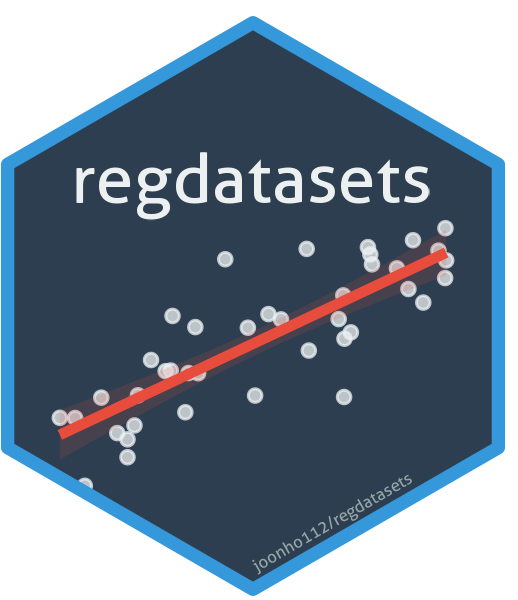

<!-- README.md is generated from README.Rmd. Please edit that file -->

```{r, include = FALSE}
knitr::opts_chunk$set(
  collapse = TRUE,
  comment = "#>",
  fig.path = "man/figures/README-",
  out.width = "100%"
)
```

# regdatasets 

<!-- badges: start -->
[](https://github.com/joonho112/regdatasets/actions/workflows/R-CMD-check.yaml)
[](https://lifecycle.r-lib.org/articles/stages.html#stable)
<!-- badges: end -->

**regdatasets** provides a curated collection of 25 datasets for teaching introductory and intermediate regression analysis in education and social science contexts. The package supports courses covering simple and multiple linear regression, ANOVA/ANCOVA, logistic regression, and ordinal response models.

## Installation

You can install regdatasets from [GitHub](https://github.com/joonho112/regdatasets) with:

```r
# install.packages("remotes")
remotes::install_github("joonho112/regdatasets")
```

## Datasets at a Glance

| Dataset | N | Vars | Topic | Primary Use |
|:--------|----:|-----:|:------|:------------|
| `gcse` | 4,059 | 9 | London schools GCSE & LRT scores | Simple & multiple linear regression |
| `pisa2000` | 4,528 | 15 | OECD PISA 2000 reading scores | ANOVA, interaction effects |
| `berkeley` | 3,593 | 3 | UC Berkeley admissions | Simpson's paradox, logistic regression |
| `crime` | 67 | 5 | Florida county crime rates | Multiple regression, partial plots |
| `instruction` | 1,190 | 12 | Reading instruction methods | One-way ANOVA, contrasts |
| `gss_1` | 2,832 | 16 | General Social Survey 1982/1994 | Logistic regression |
| `faculty` | 514 | 10 | Academic salary data | Interaction (gender × sector) |
| `penalty` | 674 | 3 | Death penalty sentencing | Logistic model fit |
| `titanic` | 1,309 | 6 | Titanic passenger survival | Logistic regression |
| `individuals` | 55,899 | 6 | BLS March 2000 CPS data | Two-way ANOVA, interaction |
| `womenlf` | 263 | 5 | Women's labor force status | Ordinal logistic regression |
| `satisfaction` | 110 | 3 | Satisfaction survey | Ordinal response models |
| ... | ... | ... | ... | *25 datasets total* |

## Quick Start

```{r example}
library(regdatasets)

# Load the GCSE dataset
data(gcse)
head(gcse)

# Simple linear regression
model <- lm(gcse ~ lrt, data = gcse)
summary(model)
```

## Usage with tidyverse and easystats

regdatasets is designed to work seamlessly with the tidyverse and easystats ecosystems:

```r
library(tidyverse)
library(easystats)
library(regdatasets)

# Load data
data(crime)

# Fit model and examine with easystats
model <- lm(c ~ hs + u, data = crime)
model_parameters(model)
check_model(model)
```

## Course Coverage

The datasets in this package span the following regression topics:

- **Simple Linear Regression**: `gcse`, `classdata_07`, `civic_ed`
- **ANCOVA**: `gcse` (with school grouping)
- **One-way ANOVA**: `instruction`, `reading`
- **Multiple Regression**: `crime`, `naep`, `nels_data`
- **Interactions**: `gcse`, `faculty`, `individuals`, `crime`
- **Nonlinear Relationships**: `grades`, `naep`
- **Model Diagnostics**: `hsbs1`, `nels_data`
- **Simple Logistic Regression**: `gss_1`, `disc`
- **Multiple Logistic Regression**: `berkeley`, `disc2`, `titanic`
- **Logistic Diagnostics**: `penalty`
- **Latent Response / GLM**: `lambert`, `individuals`
- **Ordinal Models**: `womenlf`, `satisfaction`, `alcohol1_pp`

## Citation

If you use this package in your teaching or research, please cite:

```
Lee, J. H. (2026). regdatasets: Datasets for Teaching Regression Analysis.
R package. https://github.com/joonho112/regdatasets
```

## License

MIT © [JoonHo Lee](https://github.com/joonho112)
